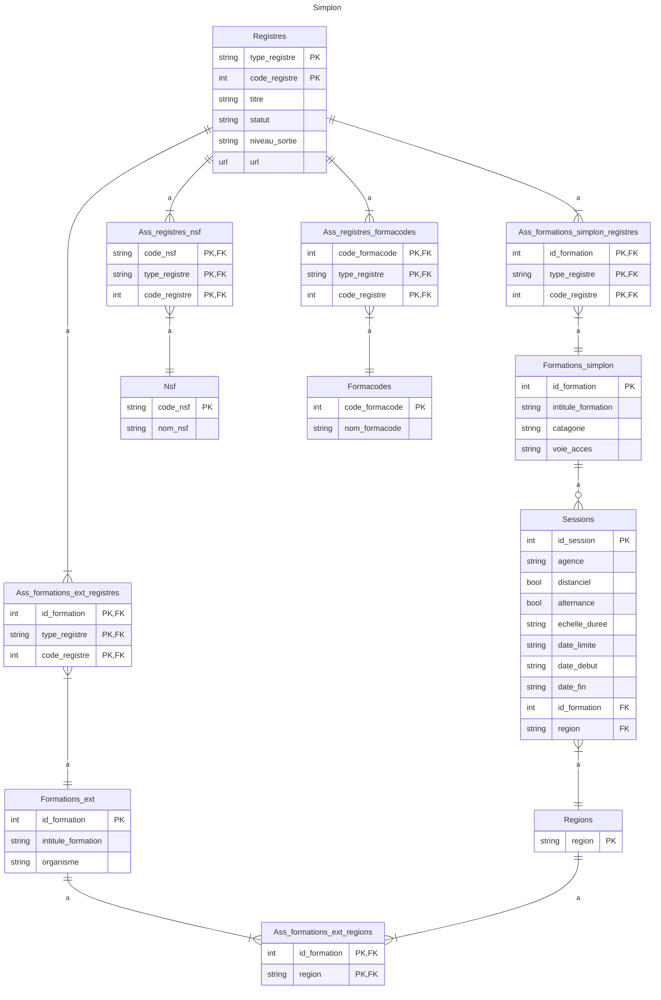

###################
README INSTRUCTIONS
###################

##################
Simplon_scraper v1
##################

prérequis pour utiliser le projet : 

> installer un environnement virtuel : poetry grâce au .toml qui fournit les noms des appli nécessaires à installer
- poetry install

> création de BDD et tables :
- script_azure_bdd.sh (exécuter le script)
- cela crée une BDD potgreSQL sur Azure
- noter l'adresse de BDD affichée dans la console (normalement elle se charge dans le .env du dossier scripts_azure)
- adresse BDD : récupérable dans le .env une fois le script azure exécuté
- l'adresse est à renseigner dans create_db.py, ainsi que dans pipelines.py (class Database) et dans models.py
- lancer create_db pour créer les tables dans la BDD

> insérer les données de moncompteformation dans la BDD Azure :
- executer le fichier >formation_simplon>mon_compte_formation>requete_api.py 
- cela crée un csv avec les données dont le projet a besoin
- exécuter >formation_simplon>formation_simplon>import_bdd.py
- cela load les données récupérées sur la BDD en ligne azure

> lancer le scraper :
- se rendre dans le dossier formation_simplon
- taper la commande "scrapy crawl simplon_spider"
- la BDD postgre se remplit en ligne 

> consulter les données :
- DBeaver > flexibleserverdb > bases de données > flexibleserverdb > Schémas > public > Tables > nom de la table souhaitée

> lancer l'API pour consulter les données
- aller dans le dossier formation_simplon>formation_simplon
- entrez la commande : uvicorn api_main:app --reload

###########
DBMS SCHEMA
###########

