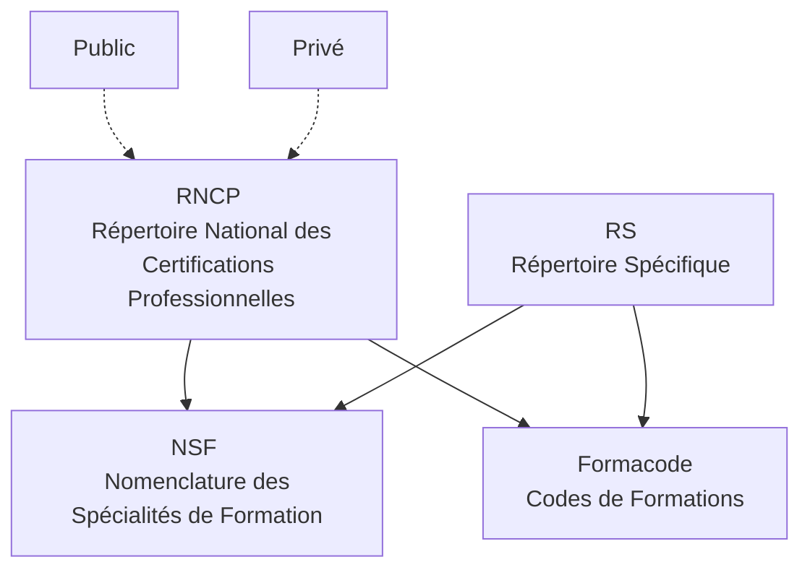
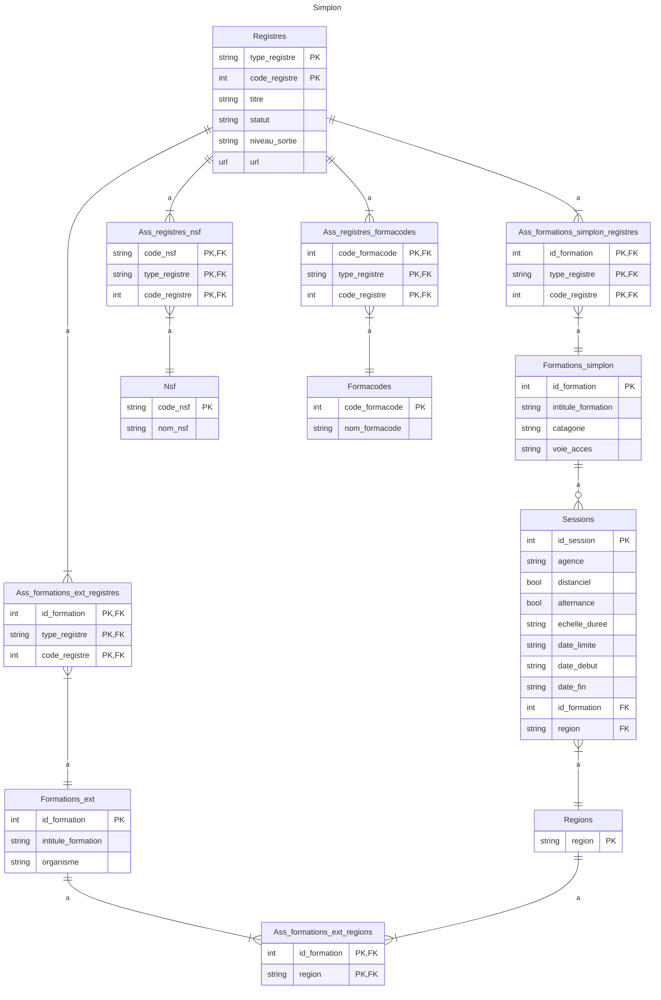

## README INSTRUCTIONS

### Simplon_benchmark v1

Prérequis : 

> il faut simplement exécuter le script à la racine du projet avec la commande : 
- . script_automatise.sh
- ATTENTION besoin d'ajouter les codes d'authentification Azure dans le fichier script_azure_bdd.sh après la ligne : #### VARIABLES A METTRE (SECRET)
################################################################################################################################################################

Explications : 

Voici comment fonctionne le projet (le script automatisé gère tout): 

> installation d'un environnement virtuel : poetry grâce au .toml qui fournit les noms des appli nécessaires à installer
- poetry install

> création d'une BDD postgreSQL sur Azure et de ses tables :
- script_azure_bdd.sh (exécution du script)
- cela crée une BDD potgreSQL sur Azure
- l'adresse de BDD complète est affichée dans la console (elle est automatiquement renseignée dans le .env du dossier scripts_azure)
- l'adresse est nécessaire dans create_db.py (fichier de création de tables dans la BDD), dans pipelines.py (class Database), dans models.py, ainsi que dans api_main.py (pour que l'api la consulte)
    >>pipelines.py "class Database" permet de renseigner la base de données avec les informations scrappées par Scrapy
    >>models.py donne les modèles et relations et clés nécessaires à la création des tables 
    >>api_main.py est notre partie "front-end" pour permettre de consulter les données présentes en BDD avec des filtres spécifiques
- lancement du fichier create_db.py pour créer les tables dans la BDD

> insertion des données récupérées depuis moncompteformation dans la BDD Azure :
- executer le fichier >formation_simplon>mon_compte_formation>requete_api.py 
- cela crée un csv avec les données de Mon Compte Formation (filtrée sur les code nsf qui nous intéressent (correspondant à ceux de Simplon)) dont le projet a besoin
- exécution de >formation_simplon>formation_simplon>import_bdd.py
- cela charge les données récupérées depuis Mon compte formation, directement sur la BDD en ligne Azure

> lancement du scraper :
- se rendre dans le dossier formation_simplon
- exécution de la commande "scrapy crawl simplon_spider"
- cela permet le remplissage de la BDD postgreSQL ligne 

> consultation des données : (à faire manuellement en parallèle si besoin) # non automatisé
- DBeaver > flexibleserverdb > bases de données > flexibleserverdb > Schémas > public > Tables > nom de la table souhaitée

> lancement de l'API pour consulter les données sur la console FastAPI
- aller dans le dossier formation_simplon>formation_simplon
- entrez la commande : uvicorn api_main:app --reload
- l'invite de commande affiche l'URL sur laquelle se rendre pour consulter les données filtrées selon les critères demandés en amont
- pour ajouter supprimer ou modifier les commandes de filtres il faudra modifier le fichier api_main.py

## GLOSSAIRE METIER

Définitions à ajouter [...]

## DBMS SCHEMA

