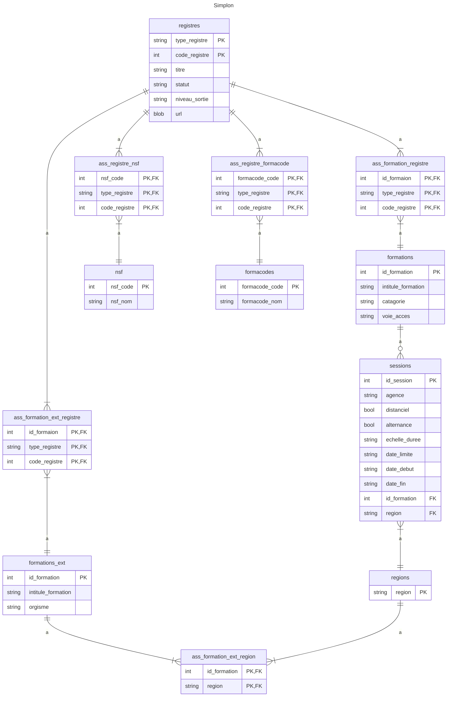

```mermaid
---
title: Simplon
---

erDiagram
    formations {
        int id_formation PK
        string intitule_formation
        string catagorie
        string voie_acces
    }
    formations_ext{
        int id_formation PK
        string intitule_formation
        string orgisme
    }
    sessions {
        int id_session PK
        string agence
        bool distanciel
        bool alternance
        string echelle_duree
        string date_limite
        string date_debut
        string date_fin
        int id_formation FK
        string region FK
    }
    regions {
        string region PK
    }
    registres {
        string type_registre PK
        int code_registre PK
        string titre
        string statut
        string niveau_sortie
        blob url
    }
    nsf {
        int nsf_code PK
        string nsf_nom
    }
    formacodes {
        int formacode_code PK
        string formacode_nom
    }
    ass_formation_registre {
        int id_formaion PK, FK
        string type_registre PK, FK
        int code_registre PK, FK
    }
    ass_formation_ext_registre {
        int id_formaion PK, FK
        string type_registre PK, FK
        int code_registre PK, FK
    }
    ass_registre_nsf {
        int nsf_code PK, FK
        string type_registre PK, FK
        int code_registre PK, FK
    }
    ass_registre_formacode {
        int formacode_code PK, FK
        string type_registre PK, FK
        int code_registre PK, FK
    }
    ass_formation_ext_region {
        int id_formation PK, FK
        string region PK, FK
    }

    registres ||--|{ ass_registre_nsf : a
    ass_registre_nsf }|--|| nsf : a
    registres ||--|{ ass_registre_formacode : a
    ass_registre_formacode }|--|| formacodes : a
    registres ||--|{ ass_formation_registre : a
    ass_formation_registre }|--|| formations : a
    registres ||--|{ ass_formation_ext_registre : a
    ass_formation_ext_registre }|--|| formations_ext : a 
    formations ||--o{ sessions : a    
    sessions }|--|| regions: a
    formations_ext ||--|{ ass_formation_ext_region : a
    regions ||--|{ ass_formation_ext_region : a 

```