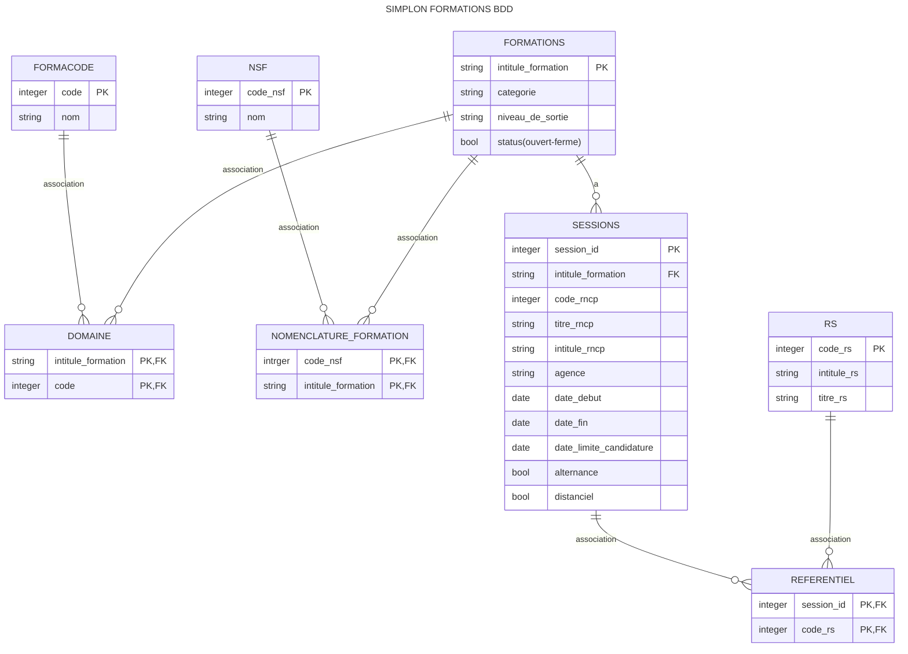

# 3_weeks_simplon_project

<!-- Data columns (total 32 columns):
 #   Column                  Non-Null Count  Dtype  
---  ------                  --------------  -----  
 0   agence                  80 non-null     object  -
 1   alternance              134 non-null    bool   -
 2   categorie               134 non-null    object -
 3   certificateur_nom_rncp  92 non-null     object 
 4   certificateur_nom_rs    79 non-null     object 
 5   code_rncp               92 non-null     float64 -
 6   code_rs                 79 non-null     float64 -
 7   date_debut              100 non-null    object -
 8   date_fin                71 non-null     object -
 9   date_limite             100 non-null    object -
 10  distanciel              134 non-null    bool   -
 11  echelle_duree           99 non-null     object 
 12  formacode_code_rncp     92 non-null     object -
 13  formacode_code_rs       79 non-null     object -
 14  formacode_nom_rncp      92 non-null     object -
 15  formacode_nom_rs        79 non-null     object -
 16  intitule_formation      134 non-null    object -
 17  niveau_sortie_rncp      92 non-null     object -
 18  nsf_code_rncp           92 non-null     object -
 19  nsf_code_rs             79 non-null     object -
 20  nsf_nom_rncp            92 non-null     object -
 21  nsf_nom_rs              79 non-null     object -
 22  region                  100 non-null    object 
 23  rncp_url                92 non-null     object 
 24  rs_url                  79 non-null     object 
 25  siret_rncp              92 non-null     float64
 26  siret_rs                79 non-null     float64
 27  statut_registre_rncp    92 non-null     object 
 28  statut_registre_rs      79 non-null     object 
 29  titre_rncp              92 non-null     object -
 30  titre_rs                79 non-null     object -
 31  voie_acces              43 non-null     object 
dtypes: bool(2), float64(4), object(26)
memory usage: 31.8+ KB -->