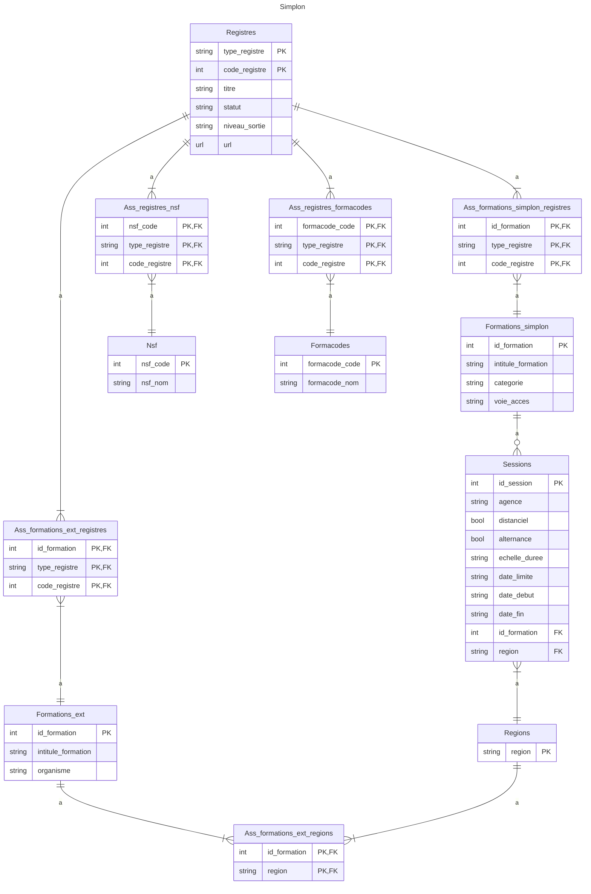

```mermaid
---
title: Simplon
---

erDiagram
    Formations_simplon {
        int id_formation PK
        string intitule_formation
        string categorie
        string voie_acces
    }
    Formations_ext{
        int id_formation PK
        string intitule_formation
        string organisme
    }
    Sessions {
        int id_session PK
        string agence
        bool distanciel
        bool alternance
        string echelle_duree
        string date_limite
        string date_debut
        string date_fin
        int id_formation FK
        string region FK
    }
    Regions {
        string region PK
    }
    Registres {
        string type_registre PK
        int code_registre PK
        string titre
        string statut
        string niveau_sortie
        url url
    }
    Nsf {
        int nsf_code PK
        string nsf_nom
    }
    Formacodes {
        int formacode_code PK
        string formacode_nom
    }
    Ass_formations_simplon_registres {
        int id_formation PK, FK
        string type_registre PK, FK
        int code_registre PK, FK
    }
    Ass_formations_ext_registres {
        int id_formation PK, FK
        string type_registre PK, FK
        int code_registre PK, FK
    }
    Ass_registres_nsf {
        int nsf_code PK, FK
        string type_registre PK, FK
        int code_registre PK, FK
    }
    Ass_registres_formacodes {
        int formacode_code PK, FK
        string type_registre PK, FK
        int code_registre PK, FK
    }
    Ass_formations_ext_regions {
        int id_formation PK, FK
        string region PK, FK
    }

    Registres ||--|{ Ass_registres_nsf : a
    Ass_registres_nsf }|--|| Nsf : a
    Registres ||--|{ Ass_registres_formacodes : a
    Ass_registres_formacodes }|--|| Formacodes : a
    Registres ||--|{ Ass_formations_simplon_registres : a
    Ass_formations_simplon_registres }|--|| Formations_simplon : a
    Registres ||--|{ Ass_formations_ext_registres : a
    Ass_formations_ext_registres }|--|| Formations_ext : a 
    Formations_simplon ||--o{ Sessions : a    
    Sessions }|--|| Regions: a
    Formations_ext ||--|{ Ass_formations_ext_regions : a
    Regions ||--|{ Ass_formations_ext_regions : a 

```